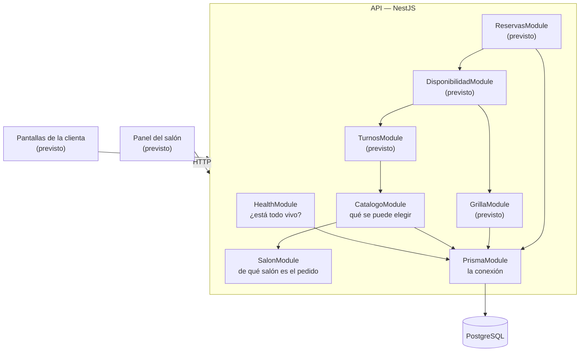

# Arquitectura y módulos

Cómo está armado el sistema, qué hace cada módulo y cómo se conectan entre sí.
Se actualiza a medida que se construye: **lo que dice acá es lo que existe**, y
lo previsto está marcado como tal.

La decisión de fondo —por qué son dos aplicaciones y no una— está en
[`adr/001-dos-aplicaciones-separadas.md`](adr/001-dos-aplicaciones-separadas.md).

## Las dos aplicaciones

| Aplicación | Qué es | Qué hace |
|---|---|---|
| `backend/` | API en NestJS | Contesta preguntas y guarda decisiones. **Toda regla de negocio vive acá** |
| `frontend/` *(previsto)* | React con Vite | Muestra y pregunta. No calcula nada del negocio |

Se comunican **solo por HTTP**. El frontend nunca importa código del backend: si
lo hiciera, dejarían de ser dos aplicaciones aunque las carpetas siguieran ahí.

## Qué arquitectura es esta

**Un monolito modular por dominio, con capas dentro de cada módulo.**

- **Monolito**: una sola aplicación de backend, un solo despliegue, una sola base
  de datos. Las *dos aplicaciones* del ADR-001 son el backend y el frontend; el
  backend es uno.
- **Modular por dominio**: se parte por área del negocio —catálogo, turnos,
  grilla, disponibilidad, reservas—, no por tipo de archivo.
- **En capas, adentro de cada módulo**: el controller traduce HTTP y no calcula,
  el service tiene las reglas, Prisma accede a los datos.
- **Sin capa de repositorio**: el service consulta Prisma directamente.

Se descartaron hexagonal, las capas globales, los microservicios y *serverless*.
El porqué de cada una está en el
[ADR-004](adr/004-monolito-modular-por-dominio.md).

## Reglas de dependencia entre módulos

Las flechas del mapa dicen qué depende de qué. Estas reglas dicen **qué está
prohibido**, que es lo que un dibujo no puede decir:

| # | Regla | Qué evita |
|---|---|---|
| 1 | Un módulo de negocio **puede** usar el service de otro, si ese módulo lo exporta | Que cada uno reimplemente lo que otro ya sabe contestar |
| 2 | **Ningún módulo consulta tablas que no son suyas** | La misma regla de negocio escrita en dos lugares |
| 3 | **No hay dependencias circulares** | Módulos que no se pueden entender, explicar ni probar por separado. Nest además no arranca |
| 4 | **La infraestructura no depende del negocio** | Que `PrismaModule` o `SalonModule` tengan que saber que existe el catálogo |

**El caso que las justifica.** El armado del turno necesita los precios del
catálogo: puede pedírselos (regla 1) o consultar la tabla `Servicio` por su
cuenta. Lo segundo es más rápido de escribir y rompe el día que el catálogo
cambie qué considera disponible — el armado sigue con la regla vieja hasta que
una clienta reserva algo que no se ofrece.

**Cada tabla tiene un módulo dueño.** Es la contracara de la regla 2:

| Tablas | Módulo dueño | Los demás |
|---|---|---|
| `Servicio`, `Extra`, `Retiro`, `ServicioExtra` | `CatalogoModule` | preguntan |
| `Salon` | `CatalogoModule` (lectura); el alta no está en el MVP | — |

Se actualiza al agregar un módulo.

## Mapa de módulos

Las flechas son dependencias reales: **quien apunta, importa al otro**. Que
`ReservasModule` dependa de `DisponibilidadModule` y no al revés no es un
detalle — significa que reservar *pregunta* si el horario entra, en vez de
decidirlo por su cuenta.

## Los módulos que existen hoy

### `PrismaModule` — la conexión a la base

- **Qué ofrece**: `PrismaService`, que abre la conexión cuando la API levanta y
  la cierra cuando se apaga.
- **De qué depende**: de `DATABASE_URL`. Si falta, la aplicación **no arranca**
  y dice qué hacer.
- **Qué no hace**: no tiene ninguna regla de negocio. Es solo el acceso.
- **No es global a propósito**: cada módulo que toca la base lo importa, y así
  queda escrito quién depende de ella.

### `HealthModule` — ¿está todo vivo?

- **Qué responde**: `GET /health` → `{"api":"ok","base":"ok"}`.
- **De qué depende**: de `PrismaModule`.
- **Cómo trabaja**: hace un `SELECT 1` real contra Postgres antes de contestar.
  Un `ok` fijo diría que todo está bien con la base caída.
- **Para qué sirve de verdad**: es lo que el servicio de despliegue consulta
  para saber si la API está sana.

### `SalonModule` — de qué salón es el pedido

- **Qué ofrece**: `SalonActualService`, con un solo método: `id()`.
- **De qué depende**: de `SALON_ID`, una variable de entorno. Si falta o no es un
  entero positivo, **la aplicación no arranca**.
- **Por qué existe**: es el **único lugar** que contesta esa pregunta. Hoy la
  respuesta es constante —la API sirve a un salón y cuál lo fija el despliegue—;
  el día que haya varios, el id va a salir del pedido y el cambio entra acá
  adentro. Los módulos que lo consultan no se enteran.
- **Qué no hace**: no consulta la base ni sabe qué es HTTP.

Ver [`adr/003-el-salon-sale-del-entorno.md`](adr/003-el-salon-sale-del-entorno.md).

### `CatalogoModule` — qué se puede elegir

- **Qué responde**: `GET /catalogo` → los servicios activos, cada uno con los
  extras compatibles que estén activos, y los retiros activos.
- **De qué depende**: de `PrismaModule` y de `SalonModule`.
- **Cómo trabaja**: filtra por el salón actual y por `activo`, ordena
  alfabéticamente en la base, y **aplana la tabla de vínculo**: `ServicioExtra`
  no se ve desde afuera.
- **Es una sola llamada y no tres** porque la pantalla de armado necesita el
  catálogo entero, y son decenas de filas que cambian poco.
- **Lo que sale por HTTP está declarado** en `catalogo.types.ts`, no heredado del
  tipo que genera Prisma: publicar un campo tiene que ser una decisión, no el
  efecto secundario de tocar una tabla.

## Los módulos previstos

Salen del alcance del MVP (`propuesta.md`, punto 2.3). Cada uno responde **una**
pregunta:

| Módulo | La pregunta que responde |
|---|---|
| `TurnosModule` | Dado lo que la clienta armó, ¿cuánto sale y cuánto dura? |
| `GrillaModule` | ¿Qué horarios ofrece el salón ese día, contando lo que se abrió y lo que se cerró? |
| `DisponibilidadModule` | ¿En qué horarios entra completo **este** turno armado? |
| `ReservasModule` | Tomar el horario y garantizar que no se lo lleven dos |

## Las tablas que existen hoy — el catálogo

Migración `20260825133434_catalogo`. Cinco tablas:

| Tabla | Qué guarda |
|---|---|
| `Salon` | El salón. En el MVP tiene una fila |
| `Servicio` | Los servicios base, con precio y duración |
| `Extra` | Los extras, con precio y duración. Cada uno una sola vez |
| `Retiro` | Los retiros, con precio y duración |
| `ServicioExtra` | Qué extra se puede sumar a qué servicio: una fila por combinación permitida |

**Son tres tablas y no una con un campo `tipo` porque la base impide guardar un
turno mal armado**: `servicioBaseId` apunta a `Servicio` y no puede apuntar a un
retiro. El porqué completo y las alternativas están en el
[ADR-002](adr/002-catalogo-en-tres-tablas.md).

Qué garantiza cada restricción, y por qué está:

| Restricción | Qué impide |
|---|---|
| `@@unique([salonId, nombre])` | Dos servicios con el mismo nombre **en el mismo salón**. El límite es del salón, no del sistema |
| `@@id([servicioId, extraId])` | Cargar dos veces la misma combinación permitida |
| `ON DELETE RESTRICT` | Borrar un salón que tenga catálogo colgando |
| `activo Boolean` | Que sacar algo del catálogo rompa los turnos que ya lo usaron |

**Convenciones del esquema:** el precio es `Int` en **pesos enteros** —el salón
no cobra centavos— y la duración es `Int` en **minutos**. El `salonId` está desde
la primera tabla porque el punto 2.3 de la propuesta declara que el diseño
contempla otros salones aunque el módulo no se construya.

**Límite conocido:** nada impide vincular un servicio de un salón con un extra de
otro — la base verifica que ambos existan, no que sean del mismo salón. En el MVP
hay un solo salón, así que el estado inválido no se puede construir. Se resuelve
con claves foráneas compuestas (ADR-002).

## Cómo se organizan las carpetas de la API

**Una carpeta por módulo, con todo lo suyo adentro** — `src/catalogo/` tiene su
`.module.ts`, su `.controller.ts`, su `.service.ts` y sus tipos. No hay carpetas
por capa (`controllers/`, `services/`): para entender una pieza se toca **una**
carpeta, no tres.

Cierra lo que el ADR-001 dejó abierto.

## Reglas que valen para todo el sistema

1. **Una regla de negocio vive en un solo lugar.** Cuánto dura un turno armado o
   si un horario está libre se contesta en un único módulo. Los demás preguntan.
2. **El controller no calcula.** Traduce HTTP y llama al servicio.
3. **Las pantallas preguntan, no recalculan.** Si el frontend suma duraciones por
   su cuenta, el día que cambie la regla va a quedar desactualizado.
4. **El invariante lo garantiza la base de datos.** "Un horario, un turno" se
   defiende con una restricción de unicidad, no con una verificación previa:
   entre que se consulta y se escribe, la otra reserva ya pasó.
5. **La grilla es dato, no código.** Los horarios se editan, no se despliegan.
6. **La API se documenta sola.** Las rutas y lo que devuelve cada una se generan
   desde el código en cada compilación y se publican en `/docs`. Por eso lo que
   sale por HTTP se declara con clases y no con `type`: un `type` se borra al
   compilar y no deja nada que documentar.

## El recorrido de una reserva *(previsto)*

El camino completo, para tenerlo a la vista mientras se construye:

1. La clienta arma su turno → `CatalogoModule` da los servicios;
   `TurnosModule` calcula precio y duración.
2. Pide ver los horarios → `DisponibilidadModule` cruza la duración del turno
   con la grilla del día y con los turnos ya tomados.
3. Elige uno y confirma → `ReservasModule` lo guarda; la base rechaza el
   segundo intento sobre el mismo horario.
4. Ve el comprobante → sale de lo que quedó guardado, no de lo que la pantalla
   creía.
