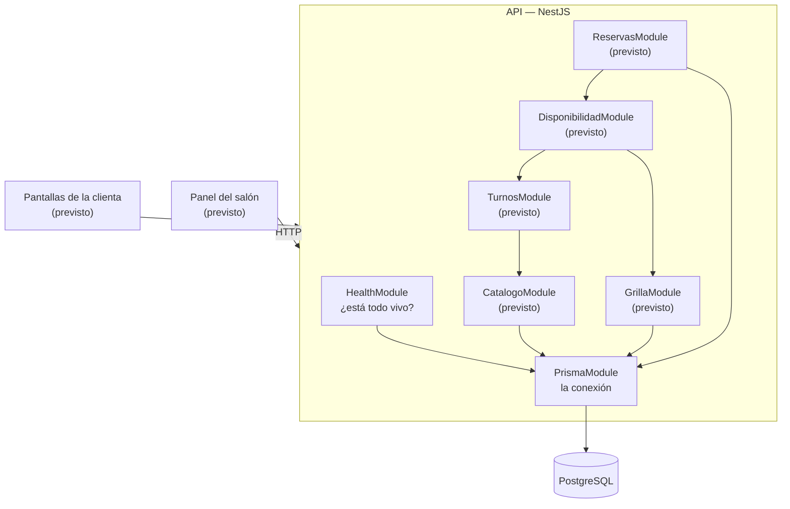

# Arquitectura y módulos

Cómo está armado el sistema, qué hace cada módulo y cómo se conectan entre sí.
Se actualiza a medida que se construye: **lo que dice acá es lo que existe**, y
lo previsto está marcado como tal.

La decisión de fondo —por qué son dos aplicaciones y no una— está en
[`adr/001-dos-aplicaciones-separadas.md`](adr/001-dos-aplicaciones-separadas.md).

## Las dos aplicaciones

| Aplicación | Qué es | Qué hace |
|---|---|---|
| `backend/` | API en NestJS | Contesta preguntas y guarda decisiones. **Toda regla de negocio vive acá** |
| `frontend/` *(previsto)* | React con Vite | Muestra y pregunta. No calcula nada del negocio |

Se comunican **solo por HTTP**. El frontend nunca importa código del backend: si
lo hiciera, dejarían de ser dos aplicaciones aunque las carpetas siguieran ahí.

## Mapa de módulos

Las flechas son dependencias reales: **quien apunta, importa al otro**. Que
`ReservasModule` dependa de `DisponibilidadModule` y no al revés no es un
detalle — significa que reservar *pregunta* si el horario entra, en vez de
decidirlo por su cuenta.

## Los módulos que existen hoy

### `PrismaModule` — la conexión a la base

- **Qué ofrece**: `PrismaService`, que abre la conexión cuando la API levanta y
  la cierra cuando se apaga.
- **De qué depende**: de `DATABASE_URL`. Si falta, la aplicación **no arranca**
  y dice qué hacer.
- **Qué no hace**: no tiene ninguna regla de negocio. Es solo el acceso.
- **No es global a propósito**: cada módulo que toca la base lo importa, y así
  queda escrito quién depende de ella.

### `HealthModule` — ¿está todo vivo?

- **Qué responde**: `GET /health` → `{"api":"ok","base":"ok"}`.
- **De qué depende**: de `PrismaModule`.
- **Cómo trabaja**: hace un `SELECT 1` real contra Postgres antes de contestar.
  Un `ok` fijo diría que todo está bien con la base caída.
- **Para qué sirve de verdad**: es lo que el servicio de despliegue consulta
  para saber si la API está sana.

## Los módulos previstos

Salen del alcance del MVP (`propuesta.md`, punto 2.3). Cada uno responde **una**
pregunta:

| Módulo | La pregunta que responde |
|---|---|
| `CatalogoModule` | ¿Qué servicios, extras y retiros hay, con qué precio y qué duración? |
| `TurnosModule` | Dado lo que la clienta armó, ¿cuánto sale y cuánto dura? |
| `GrillaModule` | ¿Qué horarios ofrece el salón ese día, contando lo que se abrió y lo que se cerró? |
| `DisponibilidadModule` | ¿En qué horarios entra completo **este** turno armado? |
| `ReservasModule` | Tomar el horario y garantizar que no se lo lleven dos |

## Reglas que valen para todo el sistema

1. **Una regla de negocio vive en un solo lugar.** Cuánto dura un turno armado o
   si un horario está libre se contesta en un único módulo. Los demás preguntan.
2. **El controller no calcula.** Traduce HTTP y llama al servicio.
3. **Las pantallas preguntan, no recalculan.** Si el frontend suma duraciones por
   su cuenta, el día que cambie la regla va a quedar desactualizado.
4. **El invariante lo garantiza la base de datos.** "Un horario, un turno" se
   defiende con una restricción de unicidad, no con una verificación previa:
   entre que se consulta y se escribe, la otra reserva ya pasó.
5. **La grilla es dato, no código.** Los horarios se editan, no se despliegan.

## El recorrido de una reserva *(previsto)*

El camino completo, para tenerlo a la vista mientras se construye:

1. La clienta arma su turno → `CatalogoModule` da los servicios;
   `TurnosModule` calcula precio y duración.
2. Pide ver los horarios → `DisponibilidadModule` cruza la duración del turno
   con la grilla del día y con los turnos ya tomados.
3. Elige uno y confirma → `ReservasModule` lo guarda; la base rechaza el
   segundo intento sobre el mismo horario.
4. Ve el comprobante → sale de lo que quedó guardado, no de lo que la pantalla
   creía.
