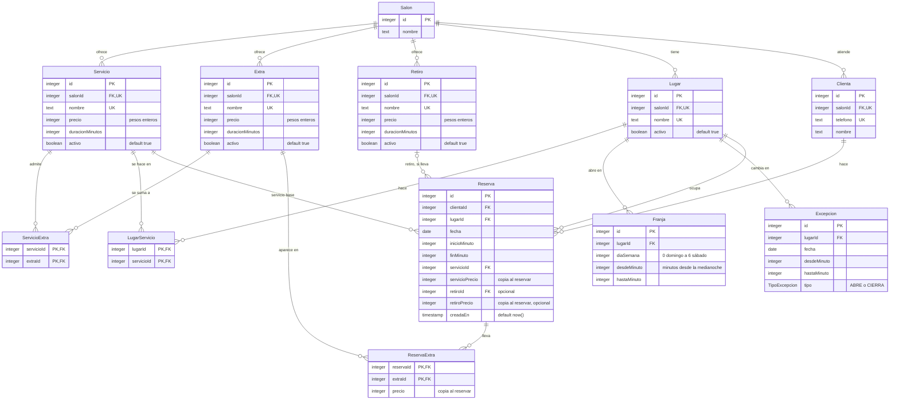

# Diagrama entidad-relación

El esquema completo de la base de datos: doce tablas en tres grupos —catálogo,
grilla y reservas—. La fuente es
[`backend/prisma/schema.prisma`](../backend/prisma/schema.prisma) y el SQL que lo
crea está en [`database/`](../database/). Qué guarda cada tabla y por qué está
armada así se explica en [`arquitectura.md`](arquitectura.md).

Los tipos son los de PostgreSQL. `PK` es clave primaria, `FK` clave foránea y
`UK` parte de una clave única.

## Índices y restricciones

Además de la clave primaria de cada tabla, que Postgres indexa sola:

| Tabla | Índice o restricción | Qué garantiza |
|---|---|---|
| `Servicio`, `Extra`, `Retiro`, `Lugar` | Único `(salonId, nombre)` | Que no haya dos con el mismo nombre en el mismo salón |
| `Clienta` | Único `(salonId, telefono)` | Que la misma clienta no esté cargada dos veces |
| `Reserva` | `EXCLUDE` con índice GiST sobre `(lugarId, fecha, [inicio, fin))` | **Que dos reservas del mismo lugar, el mismo día, no se superpongan** ([ADR-007](adr/007-un-horario-un-turno-sin-superposicion.md)) |
| `Franja` | `CHECK` del día entre 0 y 6, y de `0 ≤ desde < hasta ≤ 1440` | Una franja que no existe |
| `Excepcion` | `CHECK` de `0 ≤ desde < hasta ≤ 1440` | Una excepción que no existe |
| `Reserva` | `CHECK` de `0 ≤ inicio < fin ≤ 1440` | Un turno que no existe |
| `Reserva` | `CHECK` de que el retiro y su precio estén los dos o ninguno | Un retiro sin precio |

Todas las claves foráneas son `ON DELETE RESTRICT`: no se puede borrar algo que
otra fila usa. Para sacar algo del catálogo o una mesa de la grilla, se
desactiva con `activo`.

El `EXCLUDE` y los `CHECK` **no aparecen en `schema.prisma`**, porque Prisma no los
sabe expresar: están escritos a mano en las migraciones.
